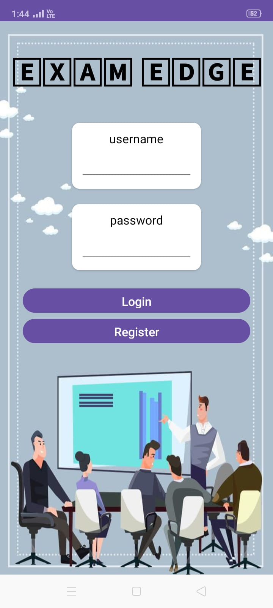

# 📚 Learning App

The **Learning App** is an Android application developed using **Android Studio** to provide an interactive and user-friendly platform for accessing educational content. This project can be used as a base for e-learning apps with clean and scalable architecture.

---

## 🚀 Features

- 📖 Topic-wise content display  
- 🔍 Easy navigation and search  
- 🎨 Simple, intuitive UI with Material Design  
- 🔐 Secure and responsive design  
- ☁️ Option to integrate with cloud-based storage or Firebase

---

## 🛠️ Technologies Used

- Android Studio
- Java 
- XML for UI Layout
- Firebase
- Material Design Components

---

## 📸 Screenshots

  
  
  
   
  
  

