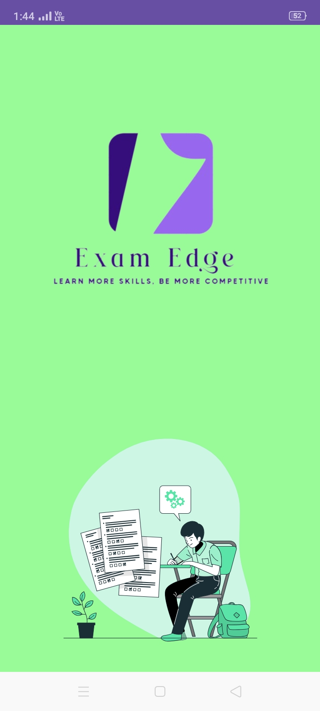

# 📚 Learning App

The **Learning App** is an Android application developed using **Android Studio** to provide an interactive and user-friendly platform for accessing educational content. This project can be used as a base for e-learning apps with clean and scalable architecture.

---

## 🚀 Features

- 📖 Topic-wise content display  
- 🔍 Easy navigation and search  
- 🎨 Simple, intuitive UI with Material Design  
- 🔐 Secure and responsive design  
- ☁️ Option to integrate with cloud-based storage or Firebase

---

## 🛠️ Technologies Used

- Android Studio
- Java 
- XML for UI Layout
- Firebase
- Material Design Components

---

## 📸 Screenshots and Descriptions

  
  
  
  
  
  ### 🟢 Splash Screen
This screen displays the app logo **Exam Edge** along with the tagline:
*Learn more skills, be more competitive*.

### 🟣 Login Screen
Users can enter their **username** and **password** here.
Two main options are available: **Login** or **Register**.

### 🟠 Home Screen
Greets the user by name (e.g., *Welcome back Sduthi*),
allows searching for interests, starting new courses, and accessing offline courses.

---

  
  
  

  ### 🟡 Main Menu
Provides main navigation options:
- **Enrollment**
- **Available Courses**
- **SMS**
- **Back to Home**

  ### 🟢 Courses In Progress
Displays a list of active courses with progress indicators, including:
- Aptitude
- Mathematics
- General Studies
- RRB

### 🟣 Available Courses
Shows a grid of available courses to browse and enroll in, such as:
- TNPSC
- RRB
- UPSC
- GATE
- NEET
- IBPS
- TET
- JEE
  
  

